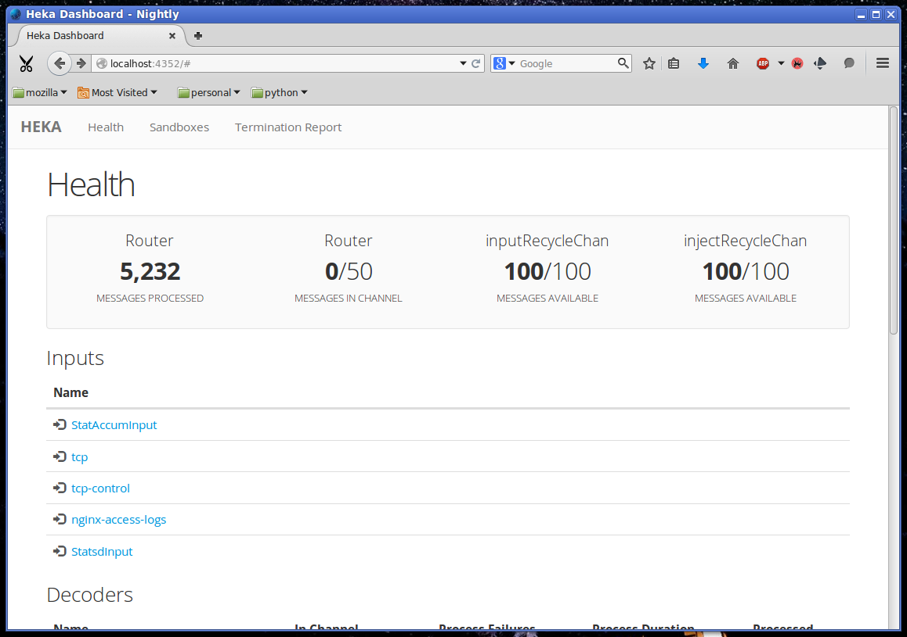
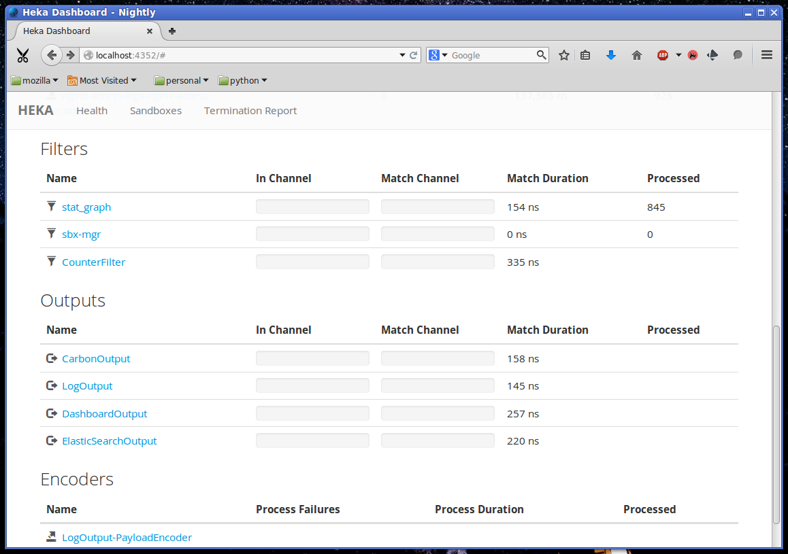
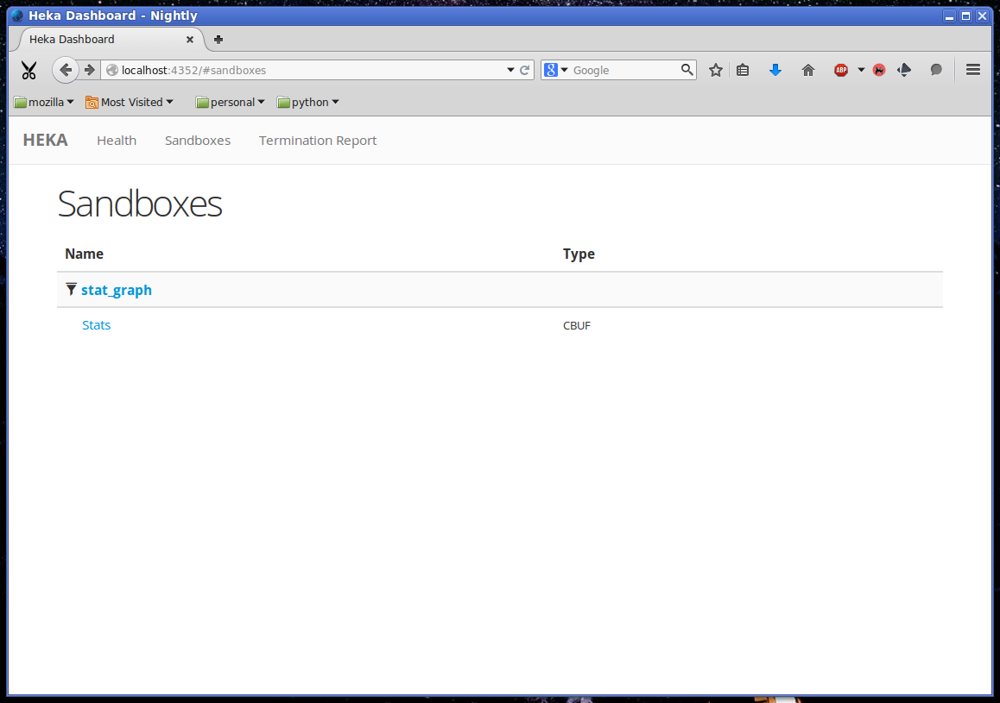
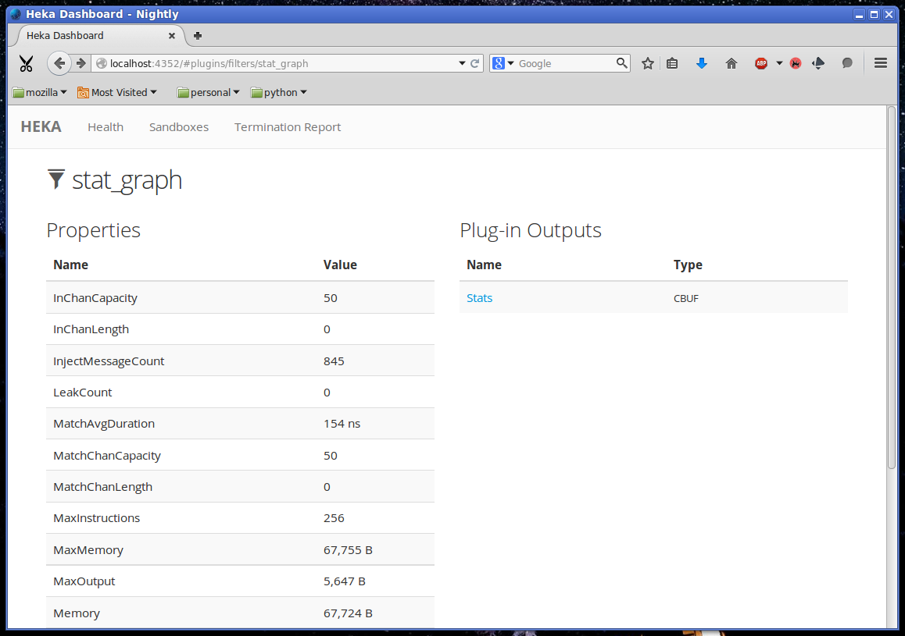
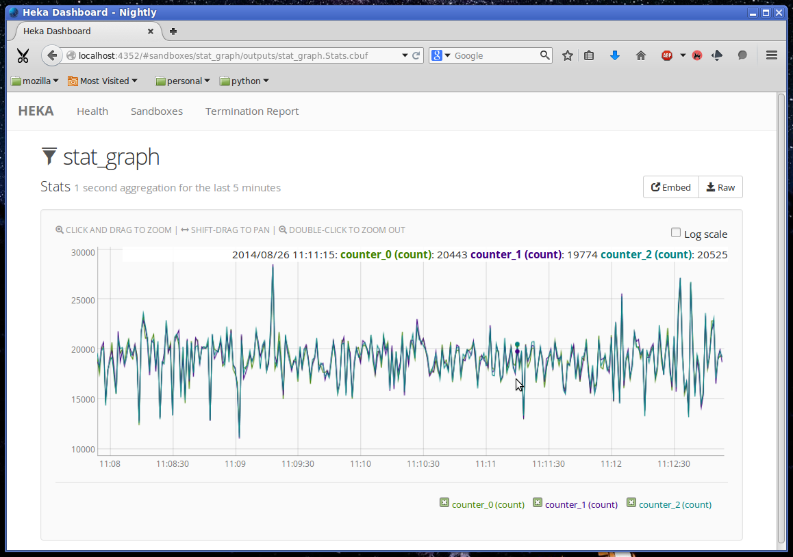

.. _getting_started:

===============
Getting Started
===============

A brand new Heka installation is something of a blank canvas, full of promise
but not actually interesting on its own. One of the challenges with a highly
flexible tool like Heka is that newcomers can easily become overwhelmed by the
wide assortment of features and options, making it difficult to understand
exactly how to begin. This document will try to address this issue by taking
readers through the process of configuring a hekad installation that
demonstrates a number of Heka's common use cases, hopefully providing enough
context that users will be able to then adjust and extend the given examples
to meet their own particular needs.

When we're done our configuration will have Heka performing the following
tasks:

* Accepting data from a statsd client over UDP.

* Forwarding aggregated statsd data on to both a Graphite Carbon server and an
  InfluxDB server.

* Generating a real time graph of a specific set of statsd statistics.

* Loading and parsing a rotating stream of nginx access log files.

* Generating JSON structures representing each request loaded from the Nginx
  log files and sending them on to an ElasticSearch database cluster.

* Generating a real time graph of the HTTP response status codes of the
  requests that were recorded in the nginx access logs.

* Performing basic algorithmic anomaly detection on HTTP status code data,
  sending notification messages via email when such events occur.

But before we dig in to that, let's make sure everything is working by trying
out a very simple setup.

Simplest Heka Config
====================

One of the simplest Heka configurations possible is one that loads a single
file from the local file system and then outputs the contents of that file to
stdout. The following is an example of such a configuration::

	[LogstreamerInput]
	log_directory = "/var/log"
	file_match = 'auth\.log'
 
	[PayloadEncoder]
	append_newlines = false
 
	[LogOutput]
	message_matcher = "TRUE"
	encoder = "PayloadEncoder"

Heka is configured via one or more `TOML <https://github.com/toml-lang/toml>`_
format configuration files, each of which is comprised of one or more
sections. The configuration above consists of three sections, the first of
which specifies a LogstreamerInput, Heka's primary mechanism for loading files
from the local file system. This one is loading `/var/log/auth.log`, but you
can change this to load any other file by editing the `log_directory` setting
to point to the folder where the file lives and the `file_match` setting to a
regular expression that uniquely matches the filename. Note the single quotes
(`'auth\\.log'`) around the regular expression; this is TOML's way of
specifying a raw string, which means we don't need to escape the regular
expression's backslashes like we would with a regular string enclosed by
double quotes (`"auth\\\\.log"`).

In most real world cases a LogstreamerInput would include a `decoder` setting,
which would parse the contents of the file to extract data from the text
format and map them onto a Heka message schema. In this case, however, we
stick with the default behavior, where Heka creates a new message for each
line in the log file, storing the text of the log line as the payload of the
Heka message.

The next two sections tell Heka what to do with the messages that the
LogstreamerInput is generating. The LogOutput simply writes data out to the
Heka process's stdout. We set `message_matcher = "TRUE"` to specify that this
output should capture every single message that flows through the Heka
pipeline. The `encoder` setting tells Heka to use the PayloadEncoder that
we've configured, which extracts the payload from each captured message and
uses that as the raw data that the output will send.

To see whether or not you have a functional Heka system, you can create a file
called `sanity_check.toml` and paste in the above configuration, adjusting the
LogstreamerInput's settings to point to another file if necessary. Then you
can run Heka using `hekad -config=/path/to/sanity_check.toml`, and you should
see the contents of the log file printed out to the console. If any new lines
are written to the log file that you're loading, Heka will notice and will
write them out to stdout in real time.

Note that the LogstreamerInput keeps track of how far it has gotten in a
particular file, so if you stop Heka using `ctrl-c` and then restart it you
will not see the same data. Heka stores the current location in a
"seekjournal" file, at `/var/cache/hekad/logstreamer/LogstreamerInput` by
default. If you delete this file and then restart Heka you should see it load
the entire file from the beginning again.

Congratulations! You've now successfully run Heka with a full, working
configuration. But clearly there are much simpler tools to use if all you want
to do is write the contents of a log file out to stdout. Now that we've got an
initial success under our belt, let's take a deeper dive into a much more
complex Heka configuration that actually handles multiple real world use
cases.

Global Configuration
====================

As mentioned above, Heka is configured using TOML configuration files. Most
sections of the TOML configuration contain information relevant to one of
Heka's plugins, but there is one section entitled `hekad` which allows you to
tweak a number of Heka's :ref:`global configuration options
<hekad_global_config_options>`. In many cases the defaults for most of these
options will suffice, and your configuration won't need a `hekad` section at
all. A few of the options are worth looking at here, however:

- maxprocs (int, default 1):
	This setting corresponds to Go's GOMAXPROCS environment variable. It
	specifies how many CPU cores the hekad process will be allowed to use. The
	best choice for this setting depends on a number of factors such as the
	volume of data Heka will be processing, the number of cores on the machine
	on which Heka is running, and what other tasks the machine will be
	performing. For dedicated Heka aggregator machines, this should usually be
	equal to the number of cpu cores available, or perhaps number of cores
	minus one, while for Heka processes running on otherwise busy boxes one or
	two is probably a better choice.

- base_dir (string, default '/var/cache/hekad' or 'c:\\var\\cache\\hekad'):
	In addition to the location of the configuration files, there are two
	directories that are important to a running `hekad` process. The first of
	these is called the `base_dir`, which is a working directory where Heka
	will be storing information crucial to its functioning, such as
	seekjournal files to track current location in a log stream, or sandbox
	filter aggregation data that is meant to survive between Heka restarts. It
	is of course important that the user under which the `hekad` process is
	running has write access to the base_dir.

- share_dir (string, default '/usr/share/heka' or 'c:\\usr\\share\\heka'):
	The second directory important to Heka's functioning is called the
	`share_dir`. This is a place where Heka expects to find certain static
	resources that it needs, such as the HTML/javascript source code used by
	the dashboard output, or the source code to various Lua based plugins. The
	user owning the `hekad` process requires read access to this folder, but
	should not have write access.

It's worth noting that while Heka defaults to expecting to find certain
resources in the `base_dir` and/or the `share_dir` folders, it is nearly
always possible to override the location of a particular resource on a case by
case basis in the plugin configuration. For instance, the `filename` option in
a SandboxFilter specifies the filesystem path to the Lua source code for that
filter. If it is specified as a relative path, the path will be computed
relative to the `share_dir`. If it is specified as an absolute path, the
absolute path will be honored.

For our example, we're going to keep the defaults for most global options,
but we'll bump the `maxprocs` setting from 1 to 2 so we can get at least
some parallel behavior::

	[hekad]
	maxprocs = 2

Accepting Statsd Data
=====================

Once we've got Heka's global settings configured, we're ready to start on the
plugins. The first thing we'll tackle is getting Heka set up to accept data
from statsd clients. This involves two different plugins, a
:ref:`config_statsd_input` that accepts network connections and parses the
received stats data, and a :ref:`config_stat_accum_input` that will accept the
data gathered by the StatsdInput, perform the necessary aggregation, and
periodically generate 'statmetric' messages containing the aggregated data.

The configuration for these plugins is quite simple::

	[StatsdInput]

	[StatAccumInput]
	ticker_interval = 1
	emit_in_fields = true

These two TOML sections tell Heka that it should include a StatsdInput and a
StatAccumInput. The StatsdInput uses the default value for every configuration
setting, while the StatAccumInput overrides the defaults for two of its
settings. The `ticker_interval = 1` setting means that the statmetric messages
will be generated once every second instead of the default of once every five
seconds, while the `emit_in_fields = true` setting means that the aggregated
stats data will be embedded in the dynamic fields of the generated statmetric
messages, in addition to the default of embedding the graphite text format in
the message payload.

This probably seems pretty straightforward, but there are actually some
subtleties hidden in there that are important to point out. First, it's not
immediately obvious, but there is an explicit connection between the two
plugins. The StatsdInput has a `stat_accum_name` setting, which we didn't need
to set because it defaults to 'StatAccumInput'. The following configuration is
exactly equivalent::

	[StatsdInput]
	stat_accum_name = "StatAccumInput"

	[StatAccumInput]
	ticker_interval = 1
	emit_in_fields = true

The next subtlety to note is that we've used a common piece of Heka config
shorthand by embedding both the name *and* the type in the TOML section
header. Heka lets you do this as a convenience if you don't need to use a name
that is separate from the type. This doesn't have to be the case, it's
possible to give a plugin a different name, expressing the type inside the
TOML section instead of in its header::

	[statsd_input]
	type = "StatsdInput"
	stat_accum_name = "stat_accumulator"

	[stat_accumulator]
	type = "StatAccumInput"
	ticker_interval = 1
	emit_in_fields = true

The config above is ever so slightly different from the original two, because
our plugins now have different name identifiers, but functionally the behavior
is identical to the prior versions. Being able to separate a plugin name from
its type is important in cases where you want more than one instance of the
same plugin type. For instance, you'd use the following configuration if you
wanted to have a second StatsdInput listening on port 8126 in addition to the
default on port 8125::

	[statsd_input_8125]
	type = "StatsdInput"
	stat_accum_name = "stat_accumulator"

	[statsd_input_8126]
	type = "StatsdInput"
	stat_accum_name = "stat_accumulator"
	address = "127.0.0.1:8126"

	[stat_accumulator]
	type = "StatAccumInput"
	ticker_interval = 1
	emit_in_fields = true

We don't need two StatsdInputs for our example, however, so for simplicity
we'll go with the most concise configuration.

Forwarding Aggregated Stats Data
================================

Collecting stats alone doesn't actually provide much value, we want to be able
to actually see the data that has been gathered. Statsd servers are typically
used to aggregate incoming statistics and then periodically deliver the totals
to an upstream time series database, usually `Graphite
<http://graphite.readthedocs.org/en/latest/index.html>`_, although `InfluxDB
<http://influxdb.com/>`_ is rapidly growing in popularity. For Heka to replace
a standalone statsd server it needs to be able to do the same.

To understand how this will work, we need to step back a bit to look at how
Heka handles message routing. First, data enters the Heka pipeline through an
input plugin. Then it needs to be converted from its original raw format into
a message object that Heka knows how to work with. Usually this is done with a
decoder plugin, although in the statsd example above instead the
StatAccumInput itself is periodically generating statmetric messages.

After the data has been marshaled into one (or more) message(s), the message
is handed to Heka's internal message router. The message router will then
iterate through all of the registered filter and output plugins to see which
ones would like to process the message. Each filter and output provides a
:ref:`message matcher <message_matcher>` to specify which messages it would
like to receive. The router hands each message to each message matcher, and if
there's a match then the matcher in turn hands the message to the plugin.

To return to our example, we'll start by setting up a
:ref:`config_carbon_output` plugin that knows how to deliver messages to an
upstream Graphite `Carbon <http://graphite.readthedocs.org/en/latest/carbon-
daemons.html>`_ server. We'll configure it to receive the statmetric messages
generated by the StatAccumInput::

	[CarbonOutput]
	message_matcher = "Type == 'heka.statmetric'"
	address = "mycarbonserver.example.com:2003"
	protocol = "udp"

Any messages that pass through the router with a Type field equal to
`heka.statmetric` (which is what the StatAccumOutput emits by default) will be
handed to this output, which will in turn deliver it over UDP to the specified
carbon server address. This is simple, but it's a fundamental concept. Nearly
all communication within Heka happens using Heka message objects being passed
through the message router and being matched against the registered matchers.

Okay, so that gets us talking to Graphite. What about InfluxDB? InfluxDB has
an extension that allows it to support the graphite format, so we could use
that and just set up a second CarbonOutput::

	[carbon]
	type = "CarbonOutput"
	message_matcher = "Type == 'heka.statmetric'"
	address = "mycarbonserver.example.com:2003"
	protocol = "udp"

	[influx]
	type = "CarbonOutput"
	message_matcher = "Type == 'heka.statmetric'"
	address = "myinfluxserver.example.com:2003"
	protocol = "udp"

A couple of things to note here. First, don't get confused by the `type =
"CarbonOutput"`, which is specifying the type of the **plugin** we are
configuring, and the "Type"  in `message_matcher = "Type ==
'heka.statmetric'"`, which is referring to the Type field of the **messages**
that are passing through the Heka router. They're both called "type", but
other than that they are unrelated.

Second, you'll see that it's fine to have more than one output (and/or filter,
for that matter) plugin with identical message_matcher settings. The router
doesn't care, it will happily give the same message to both of them, and any
others that happen to match.

This will work, but it'd be nice to just use the InfluxDB native HTTP
API. For this, we can instead use our handy HttpOutput::

	[CarbonOutput]
	message_matcher = "Type == 'heka.statmetric'"
	address = "mycarbonserver.example.com:2003"
	protocol = "udp"

	[statmetric_influx_encoder]
	type = "SandboxEncoder"
	filename = "lua_encoders/statmetric_influx.lua"

	[influx]
	type = "HttpOutput"
	message_matcher = "Type == 'heka.statmetric'"
	address = "http://myinfluxserver.example.com:8086/db/stats/series"
	encoder = "statmetric_influx_encoder"
	username = "influx_username"
	password = "influx_password"

The HttpOutput configuration above will also capture statmetric messages, and
will then deliver the data over HTTP to the specified address where InfluxDB
is listening. But wait! what's all that `statmetric-influx-encoder` stuff?
I'm glad you asked...

Encoder Plugins
===============

We've already briefly mentioned how, on the way in, raw data needs to be
converted into a standard message format that Heka's router, filters, and
outputs are able to process. Similarly, on the way out, data must be extracted
from the standard message format and serialized into whatever format is
required by the destination. This is typically achieved through the use of
encoder plugins, which take Heka messages as input and generate as output raw
bytes that an output plugin can send over the wire. The CarbonOutput doesn't
specify an encoder because it assumes that the Graphite data will be in the
message payload, where the StatAccumInput puts it, but most outputs need an
encoder to be specified so they know how to generate their data stream from
the messages that are received.

In the InfluxDB example above, you can see that we've defined a
`statmetric_influx_encoder`, of type SandboxEncoder. A "Sandbox" plugin is one
where the core logic of the plugin is implemented in Lua and is run in a
protected sandbox. Heka has support for :ref:`config_sandboxdecoder`,
:ref:`config_sandbox_filter`, and :ref:`config_sandboxencoder` plugins. In
this instance, we're using a SandboxEncoder implementation provided by Heka
that knows how to extract data from the fields of a heka.statmetric message
and use that data to generate JSON in a format that will be understood by
InfluxDB (see :ref:`config_statmetric_influx`).

This separation of concerns between encoder and output plugins allows for a
great deal of flexibility. It's easy to write your own SandboxEncoder plugins
to generate any format needed, allowing the same HttpOutput implementation can
be used for multiple HTTP-based back ends, rather than needing a separate
output plugin for each service. Also, the same encoder can be used with
different outputs. If, for instance, we wanted to write the InfluxDB formatted
data to a file system file for later processing, we could use the
statmetric_influx encoder with a FileOutput to do so.

Real Time Stats Graph
=====================

While both Graphite and InfluxDB provide mechanisms for displaying graphs of
the stats data they receive, Heka is also able to provide graphs of this data
directly. These graphs will be updated in real time, as the data is flowing
through Heka, without the latency of the data store driven graphs. The following
config snippet shows how this is done::

	[stat_graph]
	type = "SandboxFilter"
	filename = "lua_filters/stat_graph.lua"
	ticker_interval = 1
	preserve_data = true
	message_matcher = "Type == 'heka.statmetric'"

		[stat_graph.config]
		num_rows = 300
		secs_per_row = 1
		stats = "stats.counters.000000.count stats.counters.000001.count stats.counters.000002.count"
		stat_labels = "counter_0 counter_1 counter_2"
		preservation_version = 0

	[DashboardOutput]
	ticker_interval = 1

There's a lot going on in just a short bit of configuration here, so let's
consider it one piece at a time to understand what's happening. First, we've
got a `stat_graph` config section, which is telling Heka to start up a
SandboxFilter plugin, a filter plugin with the processing code implemented in
Lua. The `filename` option points to a filter implementation that ships with
Heka. This :ref:`filter implementation <config_stats_graph_filter>` knows how
to extract data from statmetric messages and store that data in a circular
buffer data structure. The `preserve_data` option tells Heka that the all
global data in this filter (the circular buffer data, in this case) should be
flushed out to disk if Heka is shut down, so it can be reloaded again when
Heka is restarted. And the `ticker_interval` option is specifying that our
filter will be emitting an output message containing the cbuf data back into
the router once every second. This message can then be consumed by other
filters and/or outputs, such as our DashboardOutput which will use it to
generate graphs (see next section).

After that we have a `stat_graph.config` section. This isn't specifying a new
plugin, this is nested configuration, a subsection of the outer `stat_graph`
section. (Note that the section nesting is specified by the use of the
`stat_graph.` prefix in the section name; the indentation helps readability,
but has no impact on the semantics of the configuration.) The `stat-graph`
section configures the SandboxFilter and tells it what Lua source code to use,
the `stat_graph.config` section is passed *in* to the Lua source code for
further customization of the filter's behavior.

So what is contained in this nested configuration? The first two options,
`num_rows` and `secs_per_row`, are configuring the circular buffer data
structure that the filter will use to store the stats data. It can be helpful
to think of circular buffer data structures as a spreadsheet. Our spreadsheet
will have 300 rows, and each row will represent one second of accumulated
data, so at any given time we will be holding five minutes worth of stats data
in our filter. The next two options, `stats` and `stat_labels`, tell Heka
which statistics we want to graph and provide shorter labels for use in the
graph legend. Finally the `preservation_version` section allows us to version
our data structures. This is needed because our data structures might change.
If you let this filter run for a while, gathering data, and then shut down
Heka, the 300 rows of circular buffer data will be written to disk. If you
then change the `num_rows` setting and try to restart Heka the filter will
fail to start, because the 300 row size of the preserved data won't match the
new size that you've specified. In this case you would increment the
`preservation_version` value from 0 to 1, which will tell Heka that the
preserved data is no longer valid and the data structures should be created
anew.

Heka Dashboard
==============

At this point it's useful to notice that, while the SandboxFilter gathers the
data that we're interested in and packages it up an a format that's useful for
graphing, it doesn't actually *do* any graphing. Instead, it periodically
creates a message of type `heka.sandbox-output`, containing the current
circular buffer data, and injects that message back into Heka's message
router. This is where the :ref:`config_dashboard_output` that we've configured
comes in.

Heka's DashboardOutput is configured by default to listen for
`heka.sandbox-output` messages (along with a few other message types, which
we'll ignore for now). When it receives a sandbox output message, it will
examine the contents of the message, and if the message contains circular
buffer data it will automatically generate a real time graph of that data.

By default, the dashboard UI is available by pointing a web browser at port
4352 of the machine where Heka is running. The first page you'll see is the
Health report, which provides an overview of the plugins that are configured,
along with some information about how messages are flowing through the Heka
pipeline:

... and scrolling further down the page ...

In the page header is a `Sandboxes` link, which will take you to a listing of
all of the running SandboxFilter plugins, along with a list of the outputs
they emit. Clicking on this we can see our `stat_graph` filter and the `Stats`
circular buffer ("CBUF") output:

If you click on the filter name `stat_graph`, you'll see a page showing
detailed information about the performance of that plugin, including how many
messages have been processed, the average amount of time a message matcher
takes to match a message, the average amount of time spent processing a
message, and more:

Finally, clicking on the `Stats` link will take us to the actual rendered
output, a line graph that updates in real time, showing the values of the
specific counter stats that we have specified in our `stat_graph`
SandboxFilter configuration:

Other stats can be added to this graph by adjusting the `stats` and
`stat_labels` values for our existing `stat_graph` filter config, although if
we do so we'll have to bump the `preservation_version` to tell Heka that the
previous data structures are no longer valid. You can create multiple graphs
by including additional SandboxFilter sections using the same `stat_graph.lua`
source code.

It also should be mentioned that, while the `stat_graph.lua` filter we've been
using only emits a single output graph, it is certainly possible for a single
filter to generate multiple graphs. It's also possible for SandboxFilters to
emit other types of output, such as raw JSON data, which the DashboardOutput
will happily serve as raw text. This can be very useful for generating ad-hoc
API endpoints based on the data that Heka is processing. Dig in to our
:ref:`sandbox` documentation to learn more about writing your own Lua filters
using our Sandbox API.

Loading and Parsing Nginx Log Files
===================================

For our next trick, we'll be loading an Nginx HTTP server's access log files
and extracting information about each HTTP request logged therein, storing it
in a more structured manner in the fields of a Heka message. The first step is
telling Heka where it can find the Nginx access log file. Except that the
Nginx log typically isn't just a single file, it's a series of files subject
to site specific rotation schemes. On the author's Ubuntu-ish system, for
instance, the `/var/log/nginx` directory looks like this, at the time of
writing::

	access.log
	access.log.1
	access.log.2.gz
	access.log.3.gz
	access.log.4.gz
	access.log.5.gz
	access.log.6.gz
	access.log.7.gz
	access.log.8.gz
	access.log.9.gz
	error.log

This is a common rotation scheme, but there are many others out there. And in
cases where many domains are being hosted, there might be several sets of log
files, one for each domain, each distinguished from the others by file and/or
folder name. Luckily Heka's :ref:`config_logstreamer_input` provides a
mechanism for handling all of these cases and more. The LogstreamerInput
already has :ref:`extensive documentation <logstreamerplugin>`, so we won't go
into exhaustive detail here, instead we'll show an example config that
correctly handles the above case::

	[nginx_access_logs]
	type = "LogstreamerInput"
	splitter = "TokenSplitter"
	decoder = "nginx_access_decoder"
	log_directory = "/var/log/nginx"
	file_match = 'access\.log\.?(?P<Index>\d+)?(.gz)?'
	priority = ["^Index"]

The `splitter` option above tells Heka that each record will be delimited by a
one character token, in this case the default token `\\n`. If our records were
delimited by a different character we could add a :ref:`config_token_splitter`
section specifying an alternate. If a single character isn't sufficient for
finding our record boundaries, such as in cases where a record spans multiple
lines, we can use a :ref:`config_regex_splitter` to provide a regular
expression that describes the record boundary. The `log_directory` option
tells where the files we're interested in live. The `file_match` is a regular
expression that matches all of the files comprising the log stream. In this
case, they all must start with `access.log`, after which they can (optionally)
be followed by a dot (`.`), then (optionally, again) one or two digits, then
(optionally, one more time) a gzip extension (`.gz`). Any digits that are
found are captured as the `Index` match group, and the `priority` option
specifies that we use this Index value to determine the order of the files.
The leading carat character (`^`) reverses the order of the priority, since in
our case lower digits mean newer files.

The LogstreamerInput will use this configuration data to find all of the
relevant files, then it will start working its way through the entire stream
of files from oldest to newest, tracking its progress along the way. If Heka
is stopped and restarted, it will pick up where it left off, even if that file
was rotated during the time that Heka was down. When it gets to the end of the
newest file, it will follow along, loading new lines as they're added,
and noticing when the file is rotated so it can hop forward to start loading the
newer one.

Which then brings us to the `decoder` option. This tells Heka which decoder
plugin the LogstreamerInput will be using to parse the loaded log files.
The `nginx_access_decoder` configuration is as follows::

	[nginx_access_decoder]
	type = "SandboxDecoder"
	filename = "lua_decoders/nginx_access.lua"

		[nginx_access_decoder.config]
		log_format = '$remote_addr - $remote_user [$time_local] "$request" $status $body_bytes_sent "$http_referer" "$http_user_agent"'
		type = "nginx.access"

Some of this should be looking familiar by now. This is a SandboxDecoder,
which means that it is a decoder plugin with the actual parsing logic
implemented in Lua. The outer config section configures the SandboxDecoder
itself, while the nested section provides additional config information that
is passed in to the Lua code.

While it's certainly possible to write your own custom Lua parsing code, in
this case we are again using a plugin :ref:`provided by Heka
<config_nginx_access_log_decoder>`, specifically designed for parsing Nginx
access logs. But Nginx doesn't have a single access log format, the exact
output is dynamically specified by a `log_format` directive in the Nginx
configuration. Luckily Heka's decoder is quite sophisticated; all you have to
do to parse your access log output is copy the appropriate `log_format`
directive out of the Nginx configuration file and paste it into the
`log_format` option in your Heka decoder config, as above, and Heka will use
the magic of `LPEG <http://www.inf.puc-rio.br/~roberto/lpeg/>`_ to dynamically
create a grammar that will extract the data from the log lines and store them
in Heka message fields. Finally the `type` option above lets you specify what
the Type field should be set to on the messages generated by this decoder.

Sending Nginx Data to ElasticSearch
===================================

One common use case people are interested in is taking the data extracted from
their HTTP server logs and sending it on to `ElasticSearch
<http://www.elasticsearch.org/>`_, often so they can peruse that data using
dashboards generated by the excellent dashboard creation tool `Kibana
<http://www.elasticsearch.org/overview/kibana/>`_. We've handled loading and
parsing the information with our input and decoder configuration above, now
let's look at the other side with the following output and encoder settings::

	[ESJsonEncoder]
	es_index_from_timestamp = true
	type_name = "%{Type}"

	[ElasticSearchOutput]
	server = "elasticsearch.example.com:9200"
	message_matcher = "Type == 'nginx.access'"
	encoder = "ESJsonEncoder"
	flush_interval = 50

Working backwards, we'll first look at the :ref:`config_elasticsearch_output`
configuration. The `server` setting indicates where ElasticSearch is
listening. The `message_matcher` tells us we'll be catching messages with a
Type value of `nginx.access`, which you'll recall was set in the decoder
configuration we discussed above. The `flush_interval` setting specifies that
we'll be batching our records in the output and flushing them out to
ElasticSearch every 50 milliseconds.

Which leaves us with the `encoder` setting, and the corresponding
:ref:`config_esjsonencoder` section. The ElasticSearchOutput uses
ElasticSearch's `Bulk API
<http://www.elasticsearch.org/guide/en/elasticsearch/reference/current/docs-
bulk.html>`_ to tell ElasticSearch how the documents should be indexed, which
means that each document insert consists of a small JSON object satisfying the
Bulk API followed by another JSON object containing the document itself. At
the time of writing, Heka provides three encoders that will extract data from
a Heka message and generate an appropriate Bulk API header, the
:ref:`config_esjsonencoder` we use above, which generates a clean document
schema based on the schema of the message that is being encoded; the
:ref:`config_eslogstashv0encoder`, which uses the "v0" schema format defined
by `Logstash <http://logstash.net/>`_ (specifically intended for HTTP request data,
natively supported by Kibana), and the :ref:`config_espayload`, which assumes
that the message payload will already contain a fully formed JSON document
ready for sending to ElasticSearch, and just prepends the necessary Bulk API
segement.

In our `ESJsonEncoder` section, we're mostly adhering to the default settings.
By default, this decoder inserts documents into an ElasticSearch index based
on the current date: `heka-YYYY.MM.DD` (spelled as `heka-%{2006.01.02}` in the
config). The `es_index_from_timestamp = true` option tells Heka to use the
timestamp from the message when determining the date to use for the index
name, as opposed to the default behavior which uses the system clock's current
time as the basis. The `type` option tells Heka what ElasticSearch record type
should be used for each record. This option supports interpolation of various
values from the message object; in the example above the message's Type field
will be used as the ElasticSearch record type name.

Generating HTTP Status Code Graphs
==================================

ElasticSearch and Kibana provide a number of nice tools for graphing and
querying the HTTP request data that is being parsed from our Nginx logs but,
as with the stats data above, it would be nice to get real time graphs of some
of this data directly from Heka. As you might guess, Heka already provides
plugins specifically for this purpose::

	[http_status]
	type = "SandboxFilter"
	filename = "lua_filters/http_status.lua"
	ticker_interval = 1
	preserve_data = true
	message_matcher = "Type == 'nginx.access'"

		[http_status.config]
		sec_per_row = 1
		rows = 1800
		perservation_version = 0

As mentioned earlier, graphing in Heka is accomplished through the cooperation
of a filter which emits messages containing circular buffer data, and the
DashboardOutput which consumes those messages and displays the data on a
graph. We already configured a DashboardOutput earlier, so now we just need to
add a filter that catches the `nginx.access` messages and aggregates the data
into a circular buffer.

Heka has a standard message format that it uses for data that represents a
single HTTP request, used by the Nginx access log decoder that is parsing our
log files. In this format, the status code of the HTTP response is stored in a
dynamic message field called, simply, `status`. The above filter will create a
circular buffer data structure to store these response status codes in 6
columns: 100s, 200s, 300s, 400s, 500s, and unknown. Similar to before, the
nested configuration tells the filter how many rows of data to keep in the
circular buffer and how many seconds of data each row should represent. It
also gives us a `preservation_version` so we can flag when the data structures
have changed.

Once we add this section to our configuration and restart hekad, we should be
able to browse to the dashboard UI and be able to find a graph of the various
response status categories that are extracted from our HTTP server logs.

Anomaly Detection
=================

We're getting close to the end of our journey. All of the data that we want to
gather is now flowing through Heka, being delivered to external data stores
for off line processing and analytics, and being displayed in real time graphs
by Heka's dashboard. The only remaining behavior we're going to activate is
anomaly detection, and the generation of notifiers based on anomalous events
being detected. We'll start by looking at the anomaly detection piece.

We've already discussed how Heka uses a `circular buffer library
<https://github.com/mozilla-
services/lua_sandbox/blob/dev/docs/circular_buffer.md>`_ to track time series
data and generate graphs in the dashboard. Well it turns out that the
:ref:`anomaly detection <sandbox_anomaly_module>` features that Heka provides
make use of the same circular buffer library.

Under the hood, how it works is that you provide an "anomaly config", which is
a string that looks something like a programming function call. The anomaly
config specifies which anomaly detection algorithm should be used. Algorithms
currently supported by Heka are a standard deviation rate of change test, and
both parametric (i.e. Gaussian) and non-parametric `Mann-Whitney-Wilcoxon
<http://en.wikipedia.org/wiki/Mann%E2%80%93Whitney_U_test>`_ tests. Included
in the anomaly config is information about which column in a circular buffer
data structure we want to monitor for anomalous behavior. Later, the parsed
anomaly config is passed in to the detection module's `detect` function, along
with a populated circular buffer data structure, and the circular buffer data
will be analyzed using the specified algorithm.

Luckily, for our use cases, you don't have to worry too much about all of the
details of using the anomaly detection library, because the SandboxFilters
we've been using have already taken care of the hard parts. All we need to do
is create an anomaly config string and add that to our config sections. For
instance, here's an example of how we might monitor our HTTP response status
codes::

	[http_status]
	type = "SandboxFilter"
	filename = "lua_filters/http_status.lua"
	ticker_interval = 1
	preserve_data = true
	message_matcher = "Type == 'nginx.access'"

		[http_status.config]
		sec_per_row = 1
		rows = 1800
		perservation_version = 0
		anomaly_config = 'roc("HTTP Status", 2, 15, 0, 1.5, true, false) mww_nonparametric("HTTP Status", 5, 15, 10, 0.8)'

Everything is the same as our earlier configuration, except we've added an
`anomaly_config` setting. There's a lot in there, so we'll examine it a piece
at a time. The first thing to notice is that there are actually two anomaly
configs specified. You can add as many as you'd like. They're space delimited
here for readability, but that's not strictly necessary, the parentheses
surrounding the config parameters are enough for Heka to identify them. Next
we'll dive into the configurations, each in turn.

The first anomaly configuration by itself looks like this::

	roc("HTTP Status", 2, 15, 0, 1.5, true, false)

The `roc` portion tells us that this config is using the rate of change
algorithm. Each algorithm has its own set of parameters, so the values inside
the parentheses are those that are required for a rate of change calculation.
The first argument is `payload_name`, which needs to correspond to the
`payload_name` value used when the message is injected back into Heka's
message router, which is "HTTP Status" in the case of this filter.

The next argument is the circular buffer column that we should be watching.
We're specifying column 2 here, which a quick peek at the `http_status.lua`
`source code <https://github.com/mozilla-
services/heka/blob/dev/sandbox/lua/filters/http_status.lua#L60>`_ will show
you is the column where we're tracking 200 status codes. The next value
specifies how many intervals (i.e. circular buffer rows) should we use in our
analysis window. We've said 15, which means that we'll be examining the rate
of change between the values in two 15 second intervals. Specifically, we'll
be comparing the data in rows 2 through 16 to the data in rows 17 through 31
(we always throw out the current row because it might not yet be complete).

After that we specify the number of intervals to use in our historical
analysis window. Our setting of 0 means we're using the entire history, rows
32 through 1800. This is followed by the standard deviation threshold
parameter, which we've set to 1.5. So, put together, we're saying if the rate
of change of the number of 200 status responses over the last two 15 second
intervals is more than 1.5 standard deviations off from the rate of change
over the 29 minutes before that, then an anomaly alert should be triggered.

The last two parameters here are boolean values. The first of these is whether
or not an alert should be fired in the event that we stop receiving input data
(we're saying yes), the second whether or not an alert should be fired if we
start receiving data again after a gap (we're saying no).

That's the first one, now let's look at the second::

	mww_nonparametric("HTTP Status", 5, 15, 10, 0.8)

The `mww_nonparametric` tells us, as you might guess, that this config will be
using the Mann-Whitney-Wilcoxon non-parametric algorithm for these
computations. This algorithm can be used to identify similarities (or
differences) between multiple data sets, even when those data sets have a non-
Gaussian distribution, such as cases where the set of data points is sparse.

The next argument tells us what column we'll be looking at. In this case we're
using column 5, which is where we store the 500 range status responses, or
server errors. After that is the number of intervals to use in a analysis
window (15), followed by the number of analysis windows to compare (10). In
this case, that means we'll be examining the last 15 seconds, and comparing
what we find there with the 10 prior 15 second windows, or the 150 previous
seconds.

The final argument is called `pstat`, which is a floating point value between
0 and 1. This tells us what type of data changes we're going to be looking
for. Anything over a 0.5 means we're looking for an increasing trend, anything
below 0.5 means we're looking for a decreasing trend. We've set this to 0.8,
which is clearly in the increasing trend range.

So, taken together, this anomaly config means that we're going to be watching
the last 15 seconds to see whether there is an anomalous spike in server
errors, compared to the 10 intervals immediately prior. If we do detect a
sizable spike in server errors, we consider it an anomaly and an alert will be
generated.

In this example, we've only specified anomaly detection on our HTTP response
status monitoring, but the `anomaly_config` option is also available to the
stat graph filter, so we could apply similar monitoring to any of the statsd
data that is contained in our statmetric messages.

Notifications
=============

But what do we mean, exactly, when we say that detecting an anomaly will
generate an alert? As with nearly everything else in Heka, what we're really
saying is that a message will be injected into the message router, which other
filter and output plugins are then able to listen for and use as a trigger for
action.

We won't go into detail here, but along with the anomaly detection module
Heka's Lua environment provides an :ref:`alert module <sandbox_alert_module>`
that generates alert messages (with throttling, to make sure hundreds of
alerts in rapid succession don't actually generate hundreds of separate
notifications) and an :ref:`annotation module <sandbox_annotation_module>`
that causes the dashboard to apply annotations to the graphs based on our
circular buffer data. Both the http status and stat graph filters make use of
both of these, so if you specify anomaly configs for either of those filters,
output graphs will be annotated and alert messages will be generated when
anomalies are detected.

Alert messages aren't of much use if they're just flowing through Heka's
message router and nothing is listening for them, however. So let's set up an
SmtpOutput that will listen for the alert messages, sending emails when they
come through::

	[alert_smtp_encoder]
	type = "SandboxEncoder"
	filename = "lua_encoders/alert.lua"

	[SmtpOutput]
	message_matcher = "Type == 'heka.sandbox-output' && Fields[payload_type] == 'alert'"
	encoder = "alert_smtp_encoder"
	send_from = "heka@example.com"
	send_to = ["alert_recipient@example.com"]
	auth = "Plain"
	user = "smtpuser"
	password = "smtpassword"
	host = "127.0.0.1:25"

First we specify an encoder, using a `very simple encoder implementation
<https://github.com/mozilla-
services/heka/blob/dev/sandbox/lua/encoders/alert.lua>`_ provided by Heka
which extracts the timestamp, hostname, logger, and payload from the message
and emits those values in a text format. Then we add the output itself,
listening for any alert messages that are emitted by any of our SandboxFilter
plugins, using the encoder to format the message body, and sending an outgoing
mail message through the SMTP server as specified by the other configuration
options.

And that's it! We're now generating email notifiers from our anomaly detection
alerts.

Tying It All Together
=====================

Here's what our full config looks like if we put it all together into a single
file::

	[hekad]
	maxprocs = 2

	[StatsdInput]

	[StatAccumInput]
	ticker_interval = 1
	emit_in_fields = true

	[CarbonOutput]
	message_matcher = "Type == 'heka.statmetric'"
	address = "mycarbonserver.example.com:2003"
	protocol = "udp"

	[statmetric-influx-encoder]
	type = "SandboxEncoder"
	filename = "lua_encoders/statmetric_influx.lua"

	[influx]
	type = "HttpOutput"
	message_matcher = "Type == 'heka.statmetric'"
	address = "http://myinfluxserver.example.com:8086/db/stats/series"
	encoder = "statmetric-influx-encoder"
	username = "influx_username"
	password = "influx_password"

	[stat_graph]
	type = "SandboxFilter"
	filename = "lua_filters/stat_graph.lua"
	ticker_interval = 1
	preserve_data = true
	message_matcher = "Type == 'heka.statmetric'"

		[stat_graph.config]
		num_rows = 300
		secs_per_row = 1
		stats = "stats.counters.000000.count stats.counters.000001.count stats.counters.000002.count"
		stat_labels = "counter_0 counter_1 counter_2"
		preservation_version = 0

	[DashboardOutput]
	ticker_interval = 1

	[nginx_access_logs]
	type = "LogstreamerInput"
	splitter = "TokenSplitter"
	decoder = "nginx_access_decoder"
	log_directory = "/var/log/nginx"
	file_match = 'access\.log\.?(?P<Index>\d+)?(.gz)?'
	priority = ["^Index"]

	[nginx_access_decoder]
	type = "SandboxDecoder"
	script_type = "lua"
	filename = "lua_decoders/nginx_access.lua"

		[nginx_access_decoder.config]
		log_format = '$remote_addr - $remote_user [$time_local] "$request" $status $body_bytes_sent "$http_referer" "$http_user_agent"'
		type = "nginx.access"

	[ESJsonEncoder]
	es_index_from_timestamp = true
	type_name = "%{Type}"

	[ElasticSearchOutput]
	message_matcher = "Type == 'nginx.access'"
	encoder = "ESJsonEncoder"
	flush_interval = 50

	[http_status]
	type = "SandboxFilter"
	filename = "lua_filters/http_status.lua"
	ticker_interval = 1
	preserve_data = true
	message_matcher = "Type == 'nginx.access'"

		[http_status.config]
		sec_per_row = 1
		rows = 1440
		perservation_version = 0
		anomaly_config = 'roc("HTTP Status", 2, 15, 0, 1.5, true, false) mww_nonparametric("HTTP Status", 5, 15, 10, 0.8)'

	[alert_smtp_encoder]
	type = "SandboxEncoder"
	filename = "lua_encoders/alert.lua"

	[SmtpOutput]
	message_matcher = "Type == 'heka.sandbox-output' && Fields[payload_type] == 'alert'"
	encoder = "alert_smtp_encoder"
	send_from = "heka@example.com"
	send_to = ["alert_recipient@example.com"]
	auth = "Plain"
	user = "smtpuser"
	password = "smtpassword"
	host = "127.0.0.1:25"

This isn't too terribly long, but even so it might be nice to break it up into
smaller pieces. Heka supports the use of a directory instead of a single file
for configuration; if you specify a directory all files ending with `.toml`
will be merged together and loaded as a single configuration, which is
preferable for more complex deployments.

This example is not in any way meant to be an exhaustive list of Heka's
features. Indeed, we've only just barely scratched the surface. Hopefully,
though, it gives those of you who are new to Heka enough context to understand
how the pieces fit together, and it can be used as a starting point for
developing configurations that will meet your own needs. If you have questions
or need assistance getting things going, please make use of the `mailing list
<https://mail.mozilla.org/listinfo/heka>`_, or use an IRC client to come visit
in the #heka channel on irc.mozilla.org.
